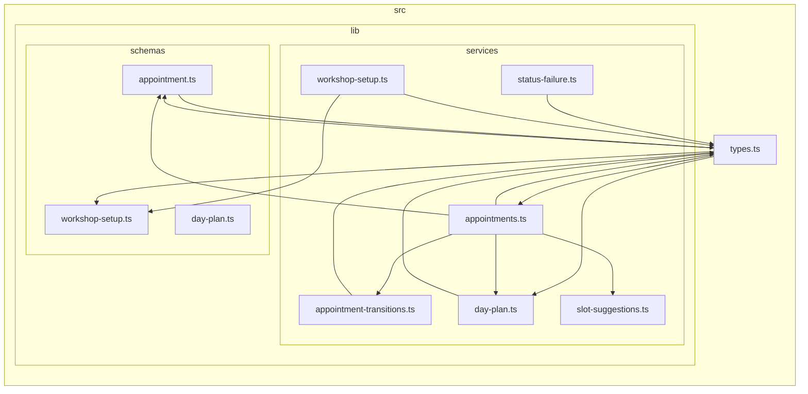

# Artifact 2 · Structure — how it is built (dependency-cruiser)

**Input:** [`artifact-1-territory.md`](./artifact-1-territory.md) · **Tool:** dependency-cruiser 18.2.0,
config `.dependency-cruiser.cjs` (generated `--init oneshot` in Phase 0, unmodified)
**Cruise:** `npx depcruise src` → **75 modules, 193 dependencies**, 3 errors, 6 warnings.

> The prompt's "Tool configuration" step is skipped — done in Phase 0. Targets are the active areas
> from artifact 1, not the whole repo: `src/pages/api`, `src/lib/services`, `src/lib/schemas`,
> `src/components`, `src/middleware.ts`, `src/lib/auth-guard.ts`, `src/lib/workshop-clock.ts`,
> `src/types.ts`, `src/db`.

⚠️ **Read §5 before using anything here as a blast-radius estimate.** dependency-cruiser does not
parse `.astro`: **14 of 73 source files are invisible**, including _every page and every layout_.

---

## 1. Cycles in the active areas

### Top observations

1. **All 6 cycles run through one file: `src/types.ts`.** Not a coincidence — artifact 1 already
   named it the code-side "common denominator" from git history alone. The dependency graph
   independently lands on the same file. Two methods, one answer.
2. **Every cycle is type-only, and that is provable, not assumed.** Re-cruising with
   `tsPreCompilationDeps: false` drops the graph from 193 → 159 dependencies and **all 6
   `no-circular` warnings disappear**. 34 edges (18%) exist only in the TypeScript type graph.
   Runtime risk: none. Design risk: real (see 3).
3. **The cycle is a deliberate inversion, not an accident.** `src/types.ts` is meant to be the
   foundation everything imports, yet it imports _upward_ from `lib/schemas` and `lib/services` to
   re-export types those modules derive (`z.infer` results, `EmptyReason`, `WireSlot`,
   `DayPlanEntry`). Shape: `types.ts → services/appointments.ts → types.ts`.
4. **In the runtime graph, `src/types.ts` and `src/db/database.types.ts` become orphans** — zero
   runtime edges in either direction. The most-imported file in the repo (fan-in 25) contributes
   **nothing at runtime**. Its coupling is entirely compile-time.
5. **The second cycle cluster is internal to `lib/services`** — `appointments.ts` ↔ `day-plan.ts`
   via `types.ts`, plus `appointments.ts → schemas/appointment.ts → types.ts → appointments.ts`.
   This is the booking vertical that artifact 1 flagged as the densest area of hands-on work.

### Evidence table

| Area                                         | What I found                                                      | dependency-cruiser evidence                                                                                                                                              | Why it matters when changing                                                                                                                                                    | Link to artifact 1                                                                | What to check next                                                                                                           |
| -------------------------------------------- | ----------------------------------------------------------------- | ------------------------------------------------------------------------------------------------------------------------------------------------------------------------ | ------------------------------------------------------------------------------------------------------------------------------------------------------------------------------- | --------------------------------------------------------------------------------- | ---------------------------------------------------------------------------------------------------------------------------- |
| `src/types.ts`                               | Hub of all 6 cycles; fan-in 25, fan-out 5                         | `no-circular` ×6, every one naming `src/types.ts`; `types.ts → {schemas/appointment, schemas/workshop-setup, services/appointments, services/day-plan}`, all `type-only` | Adding a DTO here can require an import from the module that derives it, which re-enters the cycle. TS tolerates it; a reader tracing "where does this type come from" does not | Ranked #8 by commits (8) and the code-side common denominator (16 distinct areas) | Whether the upward imports could be inverted: derived types re-exported _from_ the owner instead of pulled _into_ `types.ts` |
| `src/lib/services/`                          | `appointments.ts` in 4 of 6 cycles; fan-out 7 (highest in `lib/`) | `appointments.ts → {schemas/appointment, appointment-transitions, day-plan, slot-suggestions, supabase, workshop-clock, types}`                                          | It is the hub of the booking vertical _and_ the I/O boundary. Any change here touches 5 dependents including 3 API routes                                                       | #1 code area (19 touches); 100% of its commits also touch `context/changes/`      | Whether `appointments.ts` (375 lines, 417 lines of churn) is two modules: an orchestrator and a Supabase gateway             |
| `src/lib/schemas/`                           | `appointment.ts` in a cycle with `types.ts`                       | `schemas/appointment.ts → types.ts → schemas/appointment.ts`, both `type-only`                                                                                           | The zod schema is the source of truth for the input shape, but the domain type re-exports it — editing either moves the other                                                   | Pairs with `lib/services` in 75% of its commits (artifact 1 §3)                   | Whether `day-plan.ts` (fan-in 0, the only schema nothing imports) is dead or only used from an `.astro` page                 |
| `src/pages/api/`                             | **Zero cycles, zero fan-in**                                      | All 12 routes have fan-in 0, fan-out 2–3                                                                                                                                 | Routes are pure leaves: a change to a route cannot break anything else in the graph. The reverse is not true                                                                    | #2 code area (19 touches, only 6 commits = wide shallow sweeps)                   | Whether the two routes with three deps differ from the ten with two — a convention drift check                               |
| `src/components/`                            | **Zero cycles** across 22 modules                                 | Densest internal traffic in the repo (25 `components → components` edges) but acyclic                                                                                    | Component changes stay local; the risk here is depth, not circularity                                                                                                           | #5 code area (`appointments/` 15 touches)                                         | `DayPlanBoard.tsx`: 10 total dependencies, the heaviest module in the repo                                                   |
| `src/middleware.ts`, `src/lib/auth-guard.ts` | No cycles; guard logic cleanly extracted                          | `middleware.ts → {auth-guard, supabase, types}` fan-out 3, fan-in 0; `auth-guard.ts` fan-out 1                                                                           | The route table is a pure leaf — testable without a request. This is the repo's best-factored boundary                                                                          | Together 12 commits; artifact 1's "cross-cutting spine"                           | Nothing structural. It is the pattern the rest should copy                                                                   |
| _(tooling)_                                  | 3 `error`-severity violations are **false positives**             | `not-to-unresolvable`: `astro:env/server` ×2, `astro:middleware` ×1                                                                                                      | Wiring depcruise into CI today fails the build on Astro virtual modules                                                                                                         | —                                                                                 | Add these to `.dependency-cruiser.cjs` as known-unresolvable before any CI gate                                              |

---

## 2. Layer boundaries

Layers as the project declares them (`AGENTS.md`): `types`/`db` are the foundation, `schemas` and
`services` hold logic, `pages`+`api-routes` and `components` sit on top; `middleware` is cross-cutting.

### Top observations

1. **The two boundaries `AGENTS.md` names explicitly both hold, with zero violations.**
   `services → pages`: 0 edges. `components → db`: 0 edges. Not "few" — none.
2. **The only inversion in the entire graph is `types → {schemas, services}`** — 4 edges, all
   type-only, all the cycle from §1. Every other one of the 23 layer-to-layer edge groups points
   the declared direction.
3. **API routes are a uniform surface.** All 12 follow the same shape: fan-in 0, fan-out 2–3, into
   `schemas` + `services` (+ `lib/supabase` for the three auth routes). `api-routes → components`:
   0 edges. `api-routes → db`: 0 edges. The convention artifact 1 inferred from _sweep-shaped
   commits_ is visible in the graph as literal uniformity.
4. **`src/lib/workshop-clock.ts` is genuinely the only time-conversion module** — but the graph
   cannot prove it, so it was checked by grep: `Intl.*` appears exactly once in `src/`
   (`workshop-clock.ts:17`), and there are **zero** non-UTC `Date` accessors
   (`getHours/getDate/getMonth/getFullYear/getDay/getSeconds`) anywhere in `src/`.
5. **That rule is enforced by nothing executable.** No ESLint `no-restricted-syntax` rule, no
   depcruise rule (the rule is about _calls_, not imports — depcruise structurally cannot express
   it). It holds today on convention, docblocks and review alone.

### Evidence table

| Boundary checked                                     | Result                                        | dependency-cruiser evidence                                                                                                                           | Why it matters when changing                                                                                                                     | Link to artifact 1                                                                                                | What to check next                                                                                                                                                                               |
| ---------------------------------------------------- | --------------------------------------------- | ----------------------------------------------------------------------------------------------------------------------------------------------------- | ------------------------------------------------------------------------------------------------------------------------------------------------ | ----------------------------------------------------------------------------------------------------------------- | ------------------------------------------------------------------------------------------------------------------------------------------------------------------------------------------------ |
| `lib/services` must not import `pages/`              | ✅ **Clean**                                  | 0 edges `services → pages` / `services → api-routes` in 193 deps                                                                                      | Business logic stays callable from anywhere — a service can move behind a queue or a cron without dragging HTTP with it                          | `services` is the #1 code area; this is why its 5 unit-test files can exist                                       | Re-check after any "just read the request in the service" shortcut                                                                                                                               |
| `components/` must not reach `src/db/`               | ✅ **Clean**                                  | `db/database.types.ts` fan-in = 2, exactly `{lib/supabase.ts, types.ts}`                                                                              | The DB schema is two hops from the UI. A column rename lands in generated types → `types.ts` → components, and stops there                       | `database.types.ts` was filtered as generated noise in artifact 1; the graph shows why that was safe              | Whether `types.ts` re-exporting raw `Database[...]["Row"]` types leaks column names into the UI anyway                                                                                           |
| `types` must be a leaf (foundation)                  | ❌ **Violated, type-only**                    | 4 edges `types → {schemas/appointment, schemas/workshop-setup, services/appointments, services/day-plan}`, all `type-only`; gone in the runtime graph | Reading "what is an `Appointment`" requires opening `services/appointments.ts`. Cheap to fix, easy to keep drifting                              | Confirms artifact 1's common-denominator finding from an independent method                                       | Try inverting one of the four and see whether anything but import lines moves                                                                                                                    |
| `api-routes` are leaves                              | ✅ **Clean & uniform**                        | All 12 routes: fan-in 0; fan-out into `schemas` (9 edges) + `services` (9) + `lib` (3)                                                                | A convention change rewrites all twelve at once — cheap to do consistently, invisible when done partially                                        | Artifact 1: 19 touches in only 6 commits = cross-cutting sweeps                                                   | Diff the three auth routes (which import `lib/supabase` directly) against the nine that go through a service                                                                                     |
| `components` must not call the DB or routes directly | ✅ **Clean**                                  | `components → {components 25, lib 13, types 12, services 6}`; 0 to `db`, 0 to `api-routes`                                                            | Islands talk to the server over HTTP, not imports — so the network boundary is real and mockable in tests                                        | `components/appointments` = #5 area, `useJsonMutation` fan-in 8 is the shared HTTP path                           | Whether all 8 `useJsonMutation` callers handle failure the same way                                                                                                                              |
| `workshop-clock.ts` is the only clock                | ✅ **Holds** (verified by grep, not by graph) | Fan-in 4 (`NewAppointmentForm`, `schemas/day-plan`, `services/appointments`, `day-plan.test`); `Intl.` ×1 in `src/`, non-UTC accessors ×0             | This is the repo's load-bearing domain invariant: naive workshop-local wall-clock. A single `getHours()` silently reintroduces the host timezone | `workshop-clock.ts` 2 commits — rarely touched, so drift would come from _other_ files, where nothing is watching | ⭐ The 5 modules doing `Date` arithmetic _without_ importing it: `slot-suggestions.ts`, `services/appointments.ts`, `schemas/day-plan.ts`, `DayPlanBoard.tsx`. All UTC-safe today; all unguarded |
| `middleware` stays thin                              | ✅ **Clean**                                  | `middleware.ts → {auth-guard, supabase, types}`, fan-out 3, fan-in 0                                                                                  | Route decisions live in a pure leaf, so they are unit-testable without a request object                                                          | Artifact 1's spine cluster (`auth-guard` 7 + `middleware` 5 commits)                                              | —                                                                                                                                                                                                |

---

## 3. Testability risks

### Summary

The repo splits cleanly into **pure modules that test trivially** and **an I/O ring that does not**,
and the split follows the layer boundaries almost exactly. What is testable _is_ tested: 5 of the 6 source
modules in `lib/services` carry colocated unit tests (`workshop-setup.ts` is the exception), and the three React islands with logic carry
`happy-dom` tests. The gap is not "hard-to-test code that lacks tests" — it is a **ring of
zero-fan-in modules (12 API routes + `middleware.ts` + 5 island roots) that the unit layer
structurally cannot reach**, because nothing imports them; Astro does, at runtime, through
file-based routing and `client:*` directives. That ring is exactly where E2E (`e2e/`, 4 specs) and
pgTAP (`supabase/tests/`) have to carry the weight — and artifact 1 showed September was spent
building precisely that.

### Test risk list

| #   | Risk                                                                                                                                                                    | Evidence                                                                                                              | Recommended level                                                                                                                                                     |
| --- | ----------------------------------------------------------------------------------------------------------------------------------------------------------------------- | --------------------------------------------------------------------------------------------------------------------- | --------------------------------------------------------------------------------------------------------------------------------------------------------------------- |
| 1   | **`workshop-clock.ts` has no test at all** — the one module allowed to convert instant ↔ workshop-local, fan-in 4, and the only guard on the repo's core time invariant | No `workshop-clock.test.ts` on disk; fan-out 0 (pure, zero excuses)                                                   | **Unit — cheapest high-value gap in the repo**                                                                                                                        |
| 2   | **12 of 12 API routes have no unit test**                                                                                                                               | No `*.test.ts` beside any `src/pages/api/**`; fan-in 0 so nothing else exercises them                                 | Integration (route handler + zod + service) or E2E                                                                                                                    |
| 3   | **`services/appointments.ts` needs a hand-built Supabase fake**                                                                                                         | `appointments.test.ts:47,53` casts `{ from } as unknown as TypedSupabaseClient` — 145 lines of test, structural casts | Keep unit for the pure paths; move query correctness to pgTAP                                                                                                         |
| 4   | **`middleware.ts` is untested directly**                                                                                                                                | fan-in 0; no colocated test                                                                                           | Acceptable — its decision logic is extracted into `auth-guard.ts`, which _is_ pure and tested (`auth-guard.test.ts`). This is the pattern to copy, not a gap to close |
| 5   | **Island roots are untested and un-imported**: `NewAppointmentForm`, `SignInForm`, `SignUpForm`, `WorkshopSettings`, `UserMenu`                                         | All fan-in 0, no colocated test; mounted only from `.astro` pages the graph cannot see                                | E2E — and `e2e/` conventions already exist for it (hydration wait, SQL back door)                                                                                     |
| 6   | **`schemas/day-plan.ts` has fan-in 0** — nothing in the graph imports it                                                                                                | Only schema with no dependents                                                                                        | Verify before trusting: either it is used from an `.astro` page (invisible) or it is dead code                                                                        |
| 7   | **Three auth routes bypass the service layer**                                                                                                                          | `api/auth/{signin,signout,signup}.ts → lib/supabase.ts` directly, unlike the other nine routes                        | Their logic lives in the route, so only E2E can reach it (`e2e/signout.spec.ts` exists)                                                                               |
| 8   | **Type-only cycles hide from every test**                                                                                                                               | 6 cycles, 0 at runtime                                                                                                | No test can fail on them. If they matter, only a lint/depcruise gate will ever say so                                                                                 |

### Most suspicious modules

| Module                                         | fan-in | fan-out (int + npm) | Why suspicious                                                                                     |
| ---------------------------------------------- | -----: | ------------------: | -------------------------------------------------------------------------------------------------- |
| `src/components/appointments/DayPlanBoard.tsx` |      1 |      **8 + 2 = 10** | Heaviest module in the repo; 378 lines of churn (artifact 1 §1d); has a test, and it needs one     |
| `src/lib/services/appointments.ts`             |      5 |               7 + 0 | Orchestrator + Supabase gateway + time math in one 375-line file; in 4 of 6 cycles                 |
| `src/types.ts`                                 | **25** |               5 + 0 | Highest fan-in in the repo, orphan at runtime — pure compile-time blast radius                     |
| `src/lib/utils.ts`                             |     10 |               0 + 2 | `cn()`; untested, but a one-liner over `clsx`+`tailwind-merge` — low value, noted for completeness |
| `src/components/hooks/useJsonMutation.ts`      |      8 |               0 + 1 | The single HTTP path for every island mutation; **is** tested (`useJsonMutation.test.ts`)          |
| `src/lib/services/slot-suggestions.ts`         |      2 |           **0 + 0** | The model citizen: zero dependencies, pure, fully unit-tested. Proof the boundary pays off         |

### What to check next

- Does `src/lib/schemas/day-plan.ts` have a real caller in an `.astro` page, or is it dead?
- Do the 9 service-backed API routes and the 3 direct-to-Supabase auth routes differ on purpose?
- `slot-suggestions.ts` computes the no-overlap rule in pure TS while
  `appointments_no_overlap_per_bay` enforces it in Postgres — **two independent implementations of
  one invariant**, neither aware of the other. Prime candidate for Phase 11 (DDD invariant).
- Is `appointments.ts` splittable into orchestration + gateway without touching its 5 dependents?

---

## 4. Rendered subgraph

**Question it answers:** _why is `src/types.ts` the structural hinge of this repo?_

Scope deliberately narrow — `types.ts` + `lib/services` + `lib/schemas`, tests excluded. Not
Graphviz: `--output-type mermaid` (no `dot` on this machine, per Phase 0).

```bash
npx depcruise src \
  --include-only "^src/(types\.ts|lib/(services|schemas)/)" \
  --exclude "\.test\." \
  --output-type mermaid
```



**How to read it:** node `4` is `types.ts`. Every arrow _into_ `4` is the expected direction —
logic importing the shared vocabulary. The four arrows _out_ of `4` (`4-->3`, `4-->5`, `4-->7`,
`4-->9`) are the inversion: the foundation reaching up into schemas and services. Those four edges
are the entire cycle story of §1, and all four vanish at runtime. `A` (`slot-suggestions.ts`) is the
only node with no outgoing arrow — the repo's one fully isolated unit.

---

## 5. Limitations — carry into artifact 4

- ⚠️ **`.astro` is invisible. 14 of 73 source files, including every page and every layout**, are
  absent from the graph: `pages/{dashboard,ustawienia,404}.astro`, `pages/auth/*.astro`,
  `pages/wizyty/{[id],nowa}.astro`, `layouts/{AppShell,AuthLayout,Layout}.astro`,
  `components/{Banner,Logo}.astro`, `components/ui/LibBadge.astro`. Config
  `enhancedResolveOptions.extensions` is `[".ts", ".tsx", ".d.ts"]`. This is an explicit
  **unknown**, not an absence of coupling — artifact 1 saw `dashboard.astro` as a top-10 file from
  git history, and the graph cannot see it at all.
- **Consequence: the graph has 32 roots that are not really roots.** Every API route
  (12), `middleware.ts`, and 5 island components report fan-in 0 because Astro wires them by
  file-based routing and `client:*` directives, not by import. dependency-cruiser reports **0
  orphans** only because they have outgoing edges. **Any blast radius computed here is a lower
  bound.**
- **Type-only vs runtime is a config choice.** `tsPreCompilationDeps: true` (the `--init oneshot`
  default) is what makes the 6 cycles appear. Both numbers are stated above; neither alone is "the"
  graph.
- **3 `error` violations are Astro virtual modules** (`astro:env/server`, `astro:middleware`), not
  defects. Any CI gate needs them allow-listed first.
- **Import edges only.** The `workshop-clock` rule, the RLS/workshop scoping, and the
  `no-overlap-per-bay` constraint are all enforced at call-level or in Postgres. dependency-cruiser
  can say nothing about any of them; §2 rows 6 used grep, and the DB side is entirely outside this
  artifact.
- **`src/db/database.types.ts` is generated** (`npm run db:types`) — filtered as noise in artifact 1,
  present here with fan-in 2. Its 491 lines are not hand-maintained coupling.

---

## Reproduce

```bash
npx depcruise src --output-type json > dc.json           # 75 modules, 193 deps, 3 err / 6 warn
npx depcruise src --output-type err-long                 # the 6 cycles, readable

# prove the cycles are type-only: same cruise with tsPreCompilationDeps: false
sed 's/tsPreCompilationDeps: true/tsPreCompilationDeps: false/' .dependency-cruiser.cjs > /tmp/rt.cjs
npx depcruise src --config /tmp/rt.cjs --output-type json   # 159 deps, 0 cycles, types.ts orphaned

# the rule no graph can check
grep -rn --include="*.ts" --include="*.tsx" --include="*.astro" -E "Intl\.|\.(getHours|getDate|getMonth|getFullYear|getDay)\(\)" src

# coverage gap: which source files never reached the graph
npx depcruise src --output-type json | python3 -c "import json,sys; print({m['source'] for m in json.load(sys.stdin)['modules']})"
```

Layer matrix, fan-in/fan-out and the test-coverage cross-tab were computed with a throwaway Python
pass over `dc.json` (map each module to a layer, count edges per layer pair, invert the dependency
lists for fan-in).
