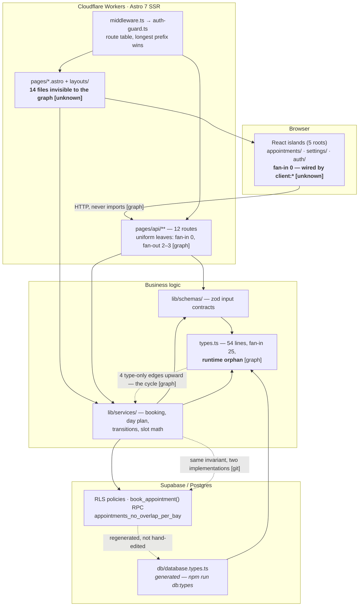

# Repo map — wulkanizator-go

**For:** a developer who has just been handed this repo. 15 minutes of reading.
**Built from:** [`artifact-1-territory.md`](./artifact-1-territory.md) (git history) ·
[`artifact-2-structure.md`](./artifact-2-structure.md) (dependency-cruiser) ·
[`artifact-3-contributors.md`](./artifact-3-contributors.md) (git identities + PR record).
Numbers are not re-derived here — follow the links for the evidence tables.

Every coupling claim below carries its provenance: **[graph]** = import graph,
**[git]** = commit history, **[grep]** = call-level check, **[unknown]** = no tool covered it.

---

## 1. TL;DR

Wulkanizator GO is a day-plan app for tyre workshops: the owner configures bays, services and
working hours, books an appointment from suggested free slots, and the team works a status board
(waiting → in progress → done → no-show). It is an Astro 7 SSR app on Cloudflare Workers, with React
19 islands for the interactive parts, Supabase/Postgres for data, auth and row-level security, and
every domain time stored as **naive workshop-local wall-clock** rather than an instant. The whole
MVP was built in one month (2026-08) by **one person** working through a documented change workflow,
which is why `context/` is 40% of all file touches — the written foundation is a first-class
territory here, not documentation noise. Work today concentrates in the **booking vertical**
(`lib/services` + `lib/schemas` + `pages/api` + `components/appointments` = 32% of code touches) and,
since September, in the test suite around it. It hurts in three places: the no-double-booking rule is
implemented **twice** (pure TypeScript and a Postgres constraint) with nothing keeping the two in
step, the wall-clock rule is enforced by **convention alone** with no test and no lint rule, and every
`.astro` page and layout is **invisible to the dependency tooling**, so every blast-radius number
here is a lower bound.

---

## 2. Territory — where the work actually is

**Big responsibility.** The booking vertical: `src/lib/services/` (#1 code area), `src/pages/api/`
(#2), `src/components/appointments/` (#5), `src/lib/schemas/`. Plus the cross-cutting spine —
`middleware.ts`, `auth-guard.ts`, `types.ts` — which is where a change stops being local **[git]**.

**Periphery.** `src/components/ui/` (shadcn, installed not written), `src/lib/utils.ts`,
`public/`, the starter leftovers (already deleted). `src/components/settings/` is a third category:
large and barely revisited — **written** territory, not **revisited** territory, and a different
risk profile from anything in the paragraph above **[git]**.

**Deep vs shallow modules** — the distinction that predicts how much it costs to change something:

| Depth                                 | Modules                                                                                                                                                                                                                                                              | Why                                                                                                   |
| ------------------------------------- | -------------------------------------------------------------------------------------------------------------------------------------------------------------------------------------------------------------------------------------------------------------------- | ----------------------------------------------------------------------------------------------------- |
| **Deep** (understand before touching) | `services/appointments.ts` (375 lines, fan-out 7, in 4 of 6 cycles), `components/appointments/DayPlanBoard.tsx` (288 lines, 10 dependencies — the heaviest module in the repo), `supabase/tests/rls_workshop_scope.test.sql` (821 lines of churn, `select plan(54)`) | Orchestration + I/O + time math in one file; every new workshop-scoped table re-opens the pgTAP suite |
| **Shallow** (safe, uniform)           | the 12 API routes (fan-in 0, fan-out 2–3, identical shape), `auth-guard.ts` (62 lines, pure), `slot-suggestions.ts` (87 lines, **zero dependencies**, fully unit-tested)                                                                                             | Leaves. A route change cannot break anything else in the graph **[graph]** — the reverse is not true  |

**Activity over time** — three regimes, not a drift **[git]**:

| Month   | Commits | Character                                                                                                           |
| ------- | ------: | ------------------------------------------------------------------------------------------------------------------- |
| 2026-06 |       4 | Bootstrap: starter scaffold, PRD, tech-stack                                                                        |
| 2026-07 |   **0** | Nothing                                                                                                             |
| 2026-08 |      81 | The entire MVP, as `/10x-new → research → plan → implement → archive` cycles                                        |
| 2026-09 |      24 | Hardening only: E2E suite, hooks, CI, docs. **`supabase/` untouched — the schema has been frozen since 2026-08-25** |

**Where the directory tree lies about the work.** Three mismatches worth knowing on day one:

1. `context/` looks like docs and behaves like source — 177 touches vs `src/`'s 160, and **100% of
   commits touching `services`, `components/appointments`, `migrations`, `tests` or `schemas` also
   touch `context/changes/`** **[git]**. The change folder is part of the build, not a report on it.
2. Only **3 of 12** folders under `context/changes/` are live; the other 9 moved to
   `context/archive/` (renames, not deletions). The archive is **immutable** — never write there.
   And one of the three live ones (`testing-api-contract-harness/`) is an empty stub: zero commits
   ever touched it.
3. `src/pages/api/` moves in **wide shallow sweeps** — 19 touches in only 6 commits, five endpoints
   touched twice each in cross-cutting passes **[git]**. It is a uniform surface: cheap to change
   consistently, and a route that drifts from the convention will not be caught by "did we touch
   that file", because the sweeps touch everything anyway.

---

## 3. Real couplings — what actually moves together

| Coupling                                                              | Strength                                  | How we know                                                                   | Cost of change                                                                                                                                                                                                                 |
| --------------------------------------------------------------------- | ----------------------------------------- | ----------------------------------------------------------------------------- | ------------------------------------------------------------------------------------------------------------------------------------------------------------------------------------------------------------------------------ |
| `lib/schemas` ↔ `lib/services`                                        | 75% of schema commits land with a service | **[git]** + **[graph]**                                                       | Real. The zod schema is the input contract; the service consumes it and `types.ts` re-exports it                                                                                                                               |
| `services/appointments.ts` → 5 dependents (3 API routes + 2 services) | fan-out 7, fan-in 5                       | **[graph]**                                                                   | Real, and the highest in `lib/`                                                                                                                                                                                                |
| `migrations` ↔ `supabase/tests`                                       | 5 commits, always together                | **[git]**                                                                     | Real and healthy — schema and its pgTAP proof ship as one unit                                                                                                                                                                 |
| `middleware.ts` ↔ `auth-guard.ts`                                     | one decision split over two files         | **[git]** + **[graph]**                                                       | Real but cheap — the route table is a pure leaf, unit-testable without a request                                                                                                                                               |
| `types.ts` ← everything (fan-in 25)                                   | 6 cycles, **all** through this file       | **[graph]**                                                                   | **Compile-time only.** Drop `tsPreCompilationDeps` and 34 edges (18%) vanish, all 6 cycles with them, and `types.ts` becomes a runtime orphan. Runtime risk: none. Reading risk: real                                          |
| `db/database.types.ts` ↔ schema                                       | changes on every migration                | **[git]**, _generated_                                                        | ⚙️ **Cheap coupling — regeneration, not editing.** `npm run db:types` rewrites it; the lefthook `pre-push` job fails the push on drift. Never hand-edit. It was filtered out of the territory analysis for exactly this reason |
| `slot-suggestions.ts` ↔ `appointments_no_overlap_per_bay`             | **the same invariant, twice**             | **[git]** — they have _never_ appeared in the same commit                     | ⚠️ The most expensive coupling in the repo precisely because no tool sees it                                                                                                                                                   |
| Islands → API routes                                                  | HTTP, not imports                         | **[graph]** — 0 edges `components → db`, 0 `components → api-routes`          | Healthy: the network boundary is real, so it is mockable in tests                                                                                                                                                              |
| `.astro` pages → everything                                           | 14 files, every page and layout           | **[unknown]** — dependency-cruiser cannot parse `.astro`; git _does_ see them | This is an **unknown, not an absence**. `dashboard.astro` is a top-10 file by history and contributes zero graph edges                                                                                                         |

**Layer boundaries hold.** `services → pages`: 0 edges. `components → db`: 0 edges. 23 of 24
layer-to-layer edge groups point the declared direction **[graph]**. The single exception is
`types.ts` importing _upward_ into `schemas` and `services` to re-export derived types — deliberate,
type-only, and undocumented.

---

## 4. Risk zones

| #   | Zone                                                                                                                 | Why it is dangerous                                                                                                                                                                                                                                       |
| --- | -------------------------------------------------------------------------------------------------------------------- | --------------------------------------------------------------------------------------------------------------------------------------------------------------------------------------------------------------------------------------------------------- |
| 1   | **The double-booking invariant** — `slot-suggestions.ts` vs `book_appointment()` + `appointments_no_overlap_per_bay` | One rule, two implementations, neither aware of the other, and **no commit has ever changed both** — the next scheduling change will silently diverge them **[git]**                                                                                      |
| 2   | **The wall-clock rule** — `workshop-clock.ts` and the 4 modules doing `Date` math without it                         | The repo's load-bearing domain invariant, and it holds today on convention alone: no test on the module, no ESLint rule, no depcruise rule (the rule is about _calls_, not imports). A single `getHours()` reintroduces the host timezone **[grep]**      |
| 3   | **The Astro-invisible ring** — 14 `.astro` files, 5 island roots, 12 API routes, `middleware.ts`                     | The unit layer structurally cannot reach it (nothing imports it — Astro wires it at runtime), so 4 Playwright specs and the pgTAP suite carry the entire weight **[unknown]**                                                                             |
| 4   | **`src/pages/api/` has zero tests** — 12 of 12 routes                                                                | The API contract harness is the one test-plan phase that is genuinely `not started`, and its change folder is an empty stub. Routes are where zod, the guard and the service meet, and nothing asserts that meeting **[git]**                             |
| 5   | **`services/appointments.ts`** — orchestrator, Supabase gateway and time math in one 375-line file                   | Its unit test has to cast a hand-built fake client (`as unknown as TypedSupabaseClient`), which is the usual symptom of a module doing two jobs                                                                                                           |
| 6   | **Rule-file drift** — `AGENTS.md` is loaded into every agent session                                                 | Three stale claims (Astro version, a deleted hook path, a tool that is no longer a dependency) were live for weeks and were only caught by this mapping exercise. Fixed in `468974e`; the _class_ of defect is structural, because there are no reviewers |

---

## 5. Who to ask

**Read this before using the section.** There is no one to ask. 109/109 commits come from **one
person** under two git identities (`tomaszskoczewski` locally, `tomskoczewski` on GitHub squash
merges), **zero** of the 6 PRs has a human review, and 44% of commits were co-produced with a Claude
model whose session is gone. So "who to ask" resolves to **which durable record answers it** — and
where no record exists, that is the bus-factor risk itself, not a lookup failure.

| Zone                     | Ask first (record)                                                                                                                    | Then                                                                                                                                    | Confidence                                                                                                    |
| ------------------------ | ------------------------------------------------------------------------------------------------------------------------------------- | --------------------------------------------------------------------------------------------------------------------------------------- | ------------------------------------------------------------------------------------------------------------- |
| 1 · Double-booking       | `context/archive/2026-08-21-add-appointment-with-slots/` — the only change with `research.md` **and** `context/` **and** both reviews | `…/2026-08-25-customer-dedupe-on-booking/reviews/impl-review.md`                                                                        | **High** — richest paper trail in the repo. But _which_ implementation leads is recorded nowhere → human only |
| 2 · Wall-clock           | `AGENTS.md` (prose rule) + the docblock in `workshop-clock.ts`                                                                        | Nothing else exists — the module arrived inside `517166b`, "Slot algorithm & Vitest (p2)"                                               | **Lowest in the repo.** 2 commits, 0 tests, 0 decision record                                                 |
| 3 · Astro ring           | `e2e/README.md` (hydration wait, per-spec window, SQL back door)                                                                      | `context/foundation/test-plan.md` §3 + §6.4; `context/changes/testing-mutation-failure-ui/`                                             | Medium — conventions written down, `client:*` rationale not                                                   |
| 4 · API tests            | `context/foundation/test-plan.md:95-120` — states plainly that Phase 1 never started                                                  | —                                                                                                                                       | High, and the answer is "nobody has done it"                                                                  |
| 5 · `appointments.ts`    | `context/archive/2026-08-21-worker-status-changes/reviews/impl-review.md` (F1–F10 triage)                                             | `appointments.test.ts` shows the seams                                                                                                  | Medium                                                                                                        |
| 6 · Scope & access       | `supabase/tests/rls_workshop_scope.test.sql` — **executable documentation**, the most reliable record here                            | `context/archive/2026-08-15-role-and-workshop-scope/` — ⚠️ `plan-review.md` only, no impl-review, unlike the five changes that have one | Medium-high — the tests carry it, the prose does not                                                          |
| — · `types.ts` inversion | **No record at all.** No change folder names the file; it was edited as a side effect of 8 feature commits                            | —                                                                                                                                       | **None**                                                                                                      |

---

## 6. First day — read these, in this order

1. **`README.md`** (Polish intro + `context/foundation/prd.md`) — what the product is and who it is
   for. Ten minutes; everything else makes more sense afterwards.
2. **`AGENTS.md`** — the hard rules. Not style preferences: SSR-only, uppercase route exports, the
   route table, the wall-clock rule, RLS on every table. Corrected on 2026-09-12, trustworthy today.
3. **`src/lib/services/slot-suggestions.ts`** (+ `.test.ts`) — 87 lines, zero dependencies, fully
   tested. The booking rule readable in isolation, and the pattern the rest should copy.
4. **`supabase/migrations/20260821090000_appointments_and_customers.sql`** and
   **`…120100_book_appointment_dedupe_customer.sql`** — the _other_ implementation of that same
   rule: the RPC and the `appointments_no_overlap_per_bay` constraint. Read 3 and 4 back to back,
   deliberately: that pairing is risk zone 1.
5. **`src/lib/services/appointments.ts`** — 375 lines, the booking vertical's hub and its I/O
   boundary. The hardest file in the repo; read it after 3–4, never before.
6. **`src/lib/auth-guard.ts` + `src/middleware.ts`** — 127 lines together, the best-factored
   boundary here. How access decisions are made, and the shape to imitate.
7. **`src/types.ts`** — 54 lines, imported by 25 modules. The shared vocabulary, and the file every
   cycle runs through.
8. **`e2e/README.md`** — the conventions for testing everything the unit layer cannot reach. Then
   run `npm run test:all` once with the local Supabase stack up (`npm run db:start`) to see the
   whole gate go green.

---

## 7. Limitations — what this map does not say

- **The window is the full history: 3 months, 109 commits** — not the 12 months the method assumes.
  Every count is small-sample; an area with 20 commits and one with 15 are not meaningfully
  different in rank.
- **Activity ≠ importance.** This maps what has been _touched_ and how modules _import_ each other.
  A correct, finished module that nobody has revisited looks identical to a forgotten one.
- **`.astro` is a hole in the structural half.** 14 of 73 source files, including every page and
  every layout. Consequence: 32 modules report fan-in 0 without being roots, and **every blast
  radius in §3 is a lower bound**.
- **Import edges only.** The wall-clock rule, RLS scoping and the no-overlap constraint are enforced
  at call level or in Postgres. No dependency graph can see any of them; §3 and §4 used grep and
  reading for those rows.
- **Type-only vs runtime is a configuration choice**, not a fact. The 6 cycles exist with
  `tsPreCompilationDeps: true` and vanish without it. Both numbers are stated on purpose.
- **`git blame` will mislead you here.** 44% of commits were co-produced with a model, so blame
  identifies who _shipped_ a line, not who _reasoned about_ it — and there are no review threads to
  fall back on.
- **17 commits live on unmerged branches** and are invisible to every table above. Work explored and
  abandoned there is not in this map.
- **Nothing here is a quality judgement.** No coverage measurement, no performance data, no security
  review. Risk zones mark where a mistake would be _expensive and unguarded_, not where bugs are.
